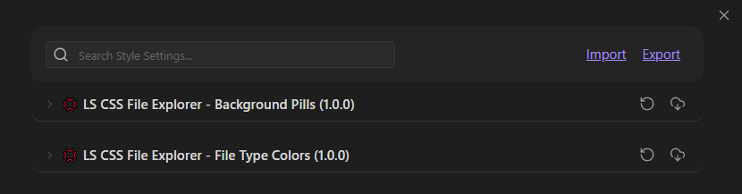
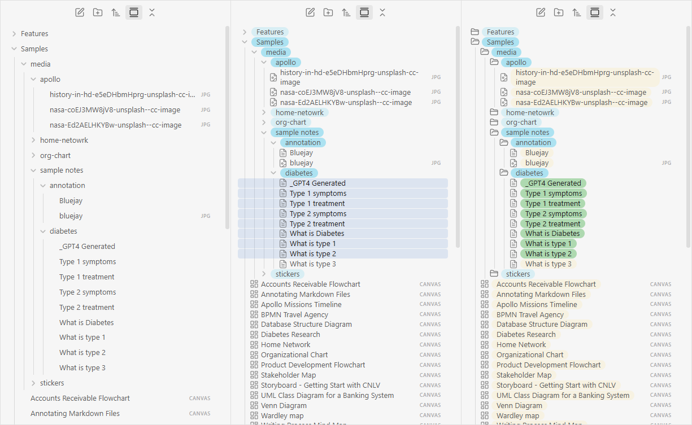
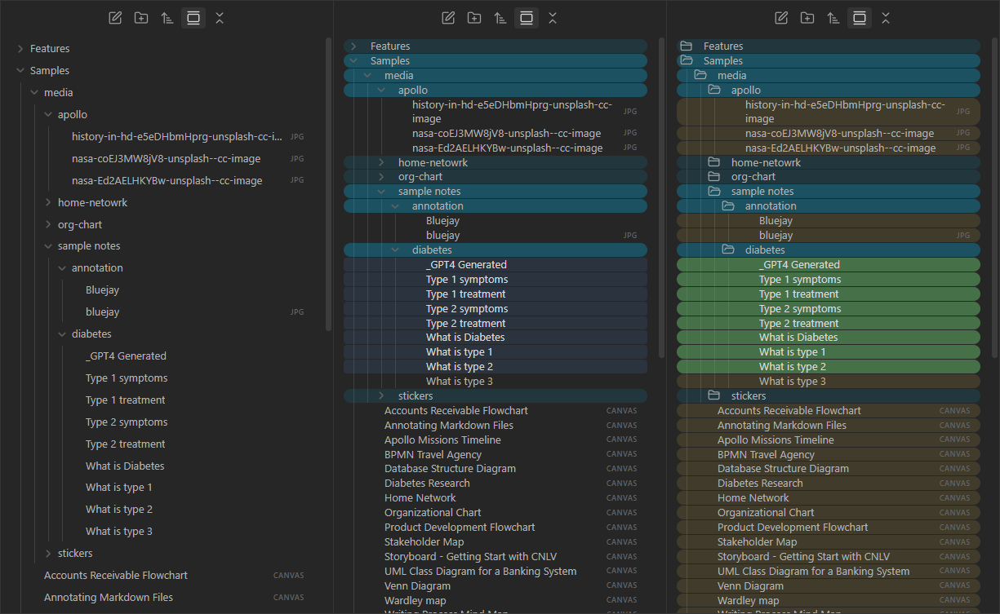
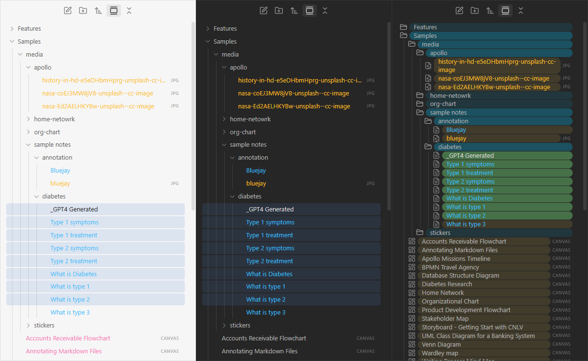

# Collection of CSS Snippets for Customizing Obsidian's Appearance

   

---
[Русский](README.md)

## About the Collection

This repository contains CSS snippets for customizing Obsidian. The snippets support configuration via the Style Settings plugin.

**Files:**
- `LS_File Explorer - Background Pills.css` — background pills for files and folders
- `LS_File Explorer - File Type Colors.css` — color labels for files based on extensions

---

## Installation

1. Download the `.css` files from the [releases](https://github.com/LoocSiL/obsidian-ls-css-collection/releases)
2. Place them in your vault's `.obsidian/snippets/` folder
3. In Obsidian: `Settings` → `Appearance` → `CSS snippets` → `Reload` and enable the ones you need

To adjust settings, install the [Style Settings](https://github.com/mgmeyers/obsidian-style-settings) plugin.

---

## Snippet Descriptions

### LS File Explorer - Background Pills

Adds background pills for file explorer items. Supports two display modes:
- inline — pill only under the text
- full row — pill spanning the entire row width

Additionally: icons for folders and files, adjustable rounding and spacing, wrapping for long names.

[Full snippet description](<docs/ENG/ENG_LS File Explorer - Background Pills.md>)

### LS File Explorer - File Type Colors

Colors file names in the explorer based on their extensions. Available categories:
- Obsidian files (.md, .canvas, .excalidraw, .base)
- Attachments (PDF, images, video, audio)
- External files (MS Office, code, others)

Color and activation can be configured for each category.

[Full snippet description](<docs/ENG/ENG_LS File Explorer - File Type Colors.md>)

---

## Support

Questions can be asked in Telegram: [excel_cad_bim_chat](https://t.me/excel_cad_bim_chat)  
Bugs and suggestions — via [Issues](https://github.com/LoocSiL/obsidian-ls-css-collection/issues)