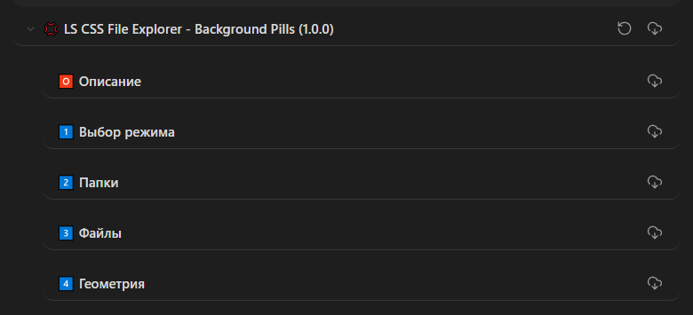
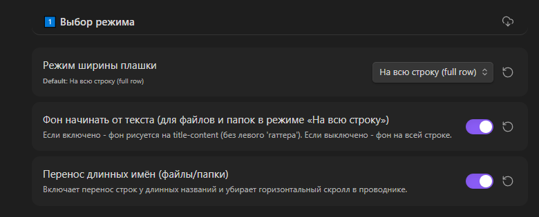
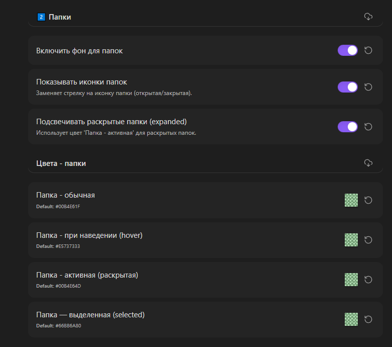
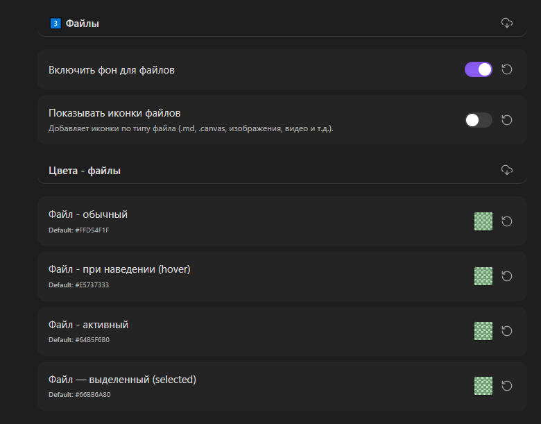
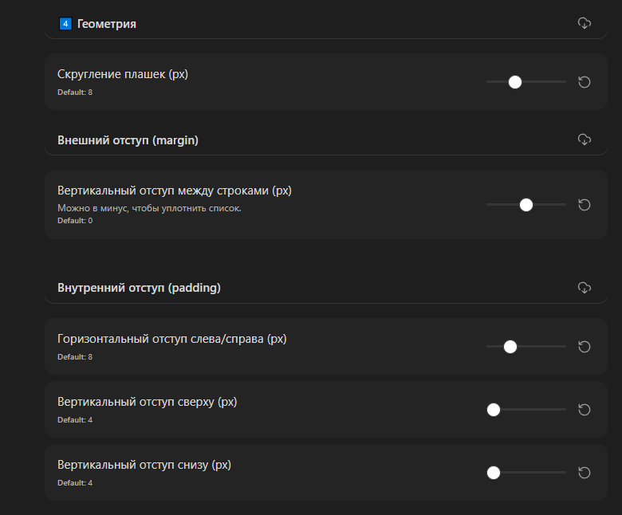

# LS File Explorer - Background Pills

## Оглавление
-  [Описание](#описание)
-  [Основные возможности](#основные-возможности)
-  [Установка](#установка)
-  [Настройка внешнего вида](#настройка-внешнего-вида)
    1. [Режимы отображения](#1-выбор-режима)
    2. [Папки](#2-папки)
    3. [Файлы](#3-файлы)
    4. [Геометрия](#4-геометрия)
-  [Примеры использования](#примеры-использования)
-  [Совместимость](#совместимость)
-  [Благодарности](#благодарности)

---

## Описание

Этот CSS-сниппет (фрагмент кода) предназначен для изменения внешнего вида **проводника файлов (File Explorer)** в Obsidian. Он добавляет цветные фоновые плашки для файлов и папок, делая навигацию по хранилищу более наглядной и структурированной.

Сниппет предлагает гибкие настройки через меню `Настройки > Внешний вид > CSS-сниппеты`, позволяя вам настроить проводник в соответствии с вашей темой оформления и личными предпочтениями.

## Основные возможности

- **Цветовые плашки:** Файлы и папки выделяются отдельными, настраиваемыми цветами.
- **Два режима ширины:**
    - **На всю строку (Full row):** Плашка занимает всю ширину проводника.
    - **Под текстом (Inline):** Плашка повторяет ширину названия файла или папки (как "таблетка").
- **Гибкая настройка цветов:** Отдельные цвета для обычного состояния, при наведении, для активных и выделенных элементов. Цвета настраиваются отдельно для файлов и папок.
- **Подсветка раскрытых папок:** Можно включить отдельный цвет для папок, которые сейчас развернуты.
- **Иконки:** Возможность заменить стандартные стрелки у папок на иконки, а также добавить различные иконки для файлов в зависимости от их типа (Markdown, Canvas, изображения, видео, аудио и др.).
- **Управление геометрией:** Настройка скругления углов, внутренних отступов (padding) и вертикальных промежутков между элементами.
- **Перенос длинных названий:** Включение этой опции убирает горизонтальную прокрутку и переносит слишком длинные имена файлов и папок на новую строку.

## Установка

1.  Сохраните файл сниппета (`LS_File Explorer - Background Pills.css`) в папку `.obsidian/snippets/` вашего хранилища Obsidian.
2.  В Obsidian откройте **Настройки** (Settings).
3.  Перейдите в раздел **Внешний вид** (Appearance).
4.  Прокрутите вниз до блока **CSS-сниппеты** (CSS snippets).
5.  Нажмите кнопку **Обновить** (Reload), чтобы увидеть список доступных сниппетов.
6.  Включите сниппет `LS File Explorer - Background Pills` с помощью переключателя.

После включения в ваших настройках (в самом низу списка CSS-сниппетов) появится новый блок настроек `💢 LS CSS File Explorer - Background Pills`.

## Настройка внешнего вида

Все настройки производятся через стандартный интерфейс Obsidian. После включения сниппета найдите соответствующий блок в конце страницы настроек "Внешний вид".

### 1. Выбор режима

- **Режим ширины плашки:** Выберите один из двух вариантов.
    - *На всю строку (full row):* Плашка фона растягивается на всю доступную ширину проводника.
    - *Под текстом (inline):* Плашка фона оборачивается только вокруг текста названия.
- **Фон начинать от текста (для режима «На всю строку»):** Если этот параметр включен, фоновая плашка будет начинаться сразу после иконки/стрелки, не захватывая левую часть строки. Если выключен — плашка рисуется на всей строке целиком.
- **Перенос длинных имён:** Включите эту опцию, чтобы названия, которые не помещаются по ширине, переносились на следующую строку. Это убирает горизонтальную прокрутку.

### 2. Папки

- **Включить фон для папок:** Основной переключатель применения настроек к папкам.
- **Показывать иконки папок:** Заменяет стандартные стрелки раскрытия на иконки закрытой и открытой папки.
- **Подсвечивать раскрытые папки (expanded):** При включении этой опции для развернутых папок будет использоваться цвет из поля "Папка - активная".

#### Цвета папок
- **Папка - обычная:** Цвет фона для закрытой папки в спокойном состоянии.
- **Папка - при наведении (hover):** Цвет фона при наведении курсора на папку.
- **Папка - активная (раскрытая):** Цвет фона для папки, которая раскрыта (показывает своё содержимое). Используется, если включена опция "Подсвечивать раскрытые папки".
- **Папка — выделенная (selected):** Цвет фона для папки, которая выделена (например, при клике по ней).

### 3. Файлы

- **Включить фон для файлов:** Основной переключатель применения настроек к файлам.
- **Показывать иконки файлов:** Добавляет слева от названия файла иконку, соответствующую его типу. Поддерживаются типы: Markdown (.md), Canvas (.canvas), Excalidraw (.excalidraw.md), изображения, аудио, видео, .webm, .loom.

#### Цвета файлов
- **Файл - обычный:** Цвет фона для файла в спокойном состоянии.
- **Файл - при наведении (hover):** Цвет фона при наведении курсора на файл.
- **Файл - активный:** Цвет фона для активного файла (например, открытого в текущей вкладке).
- **Файл — выделенный (selected):** Цвет фона для файла, который выделен (например, для переименования или перемещения).

### 4. Геометрия

- **Скругление плашек (px):** Определяет радиус скругления углов у всех плашек.
- **Внешний отступ (margin):**
    - *Вертикальный отступ между строками:* Задает промежуток между элементами (файлами и папками) по вертикали. Можно установить отрицательное значение, чтобы сделать список более плотным.
- **Внутренний отступ (padding):**
    - *Горизонтальный отступ слева/справа:* Отступ от текста до границ плашки по горизонтали.
    - *Вертикальный отступ сверху/снизу:* Отступ от текста до границ плашки по вертикали.

## Примеры использования

- **Классический вид:** Режим "На всю строку", скругление 6-8px, небольшие отступы, приглушенные цвета.
- **Минимализм:** Режим "Под текстом", скругление 12-16px, контрастные цвета для выделения.
- **Улучшенная навигация:** Включите иконки для файлов и папок, настройте яркие цвета для активных и раскрытых элементов, чтобы быстрее ориентироваться в структуре заметок.

> [!TIP] 
> Цвет фона плашки можно сделать прозрачным - это дает больше возможности для кастомизации интерфейса!

## Совместимость

Сниппет разработан для Obsidian и использует его стандартные CSS-классы. Он должен корректно работать с большинством тем оформления, однако возможны незначительные конфликты со сторонними темами, которые также кардинально меняют стиль проводника. Вопросы по совместимости можно задать в чате автора.

## Благодарности

Спасибо за использование данного сниппета. Если у вас есть предложения по улучшению или вы нашли ошибку, пожалуйста, сообщите об этом в Telegram-чате.

**Чат поддержки:** [excel_cad_bim_chat](https://t.me/excel_cad_bim_chat)